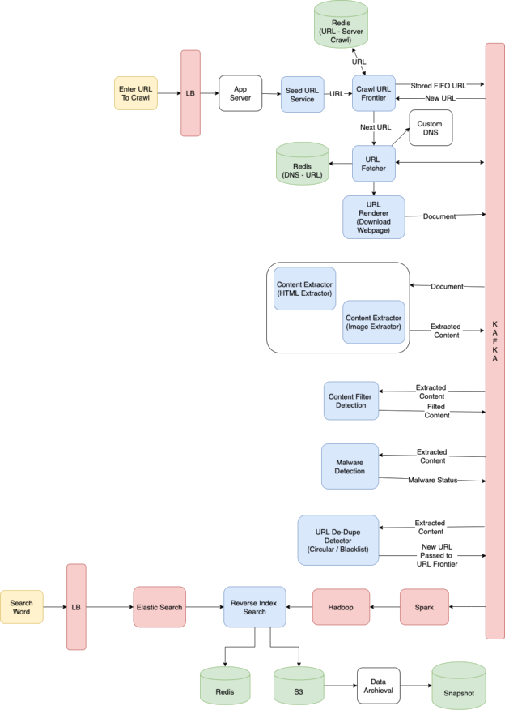

Crawler Architecture

 

<h2 align="center">Component Design</h2>

- [Seed URL](https://github.com/imthaghost/crawler/pkg/seed) A web crawler starts with a URL to visit, called the _seeds_.  Remove an absolute URL from the shared URL frontier for downloading.

- [Crawl Frontier](https://github.com/imthaghost/crawler/pkg/frontier) **URL Frontier** is a data structure that contains all the URLs that are to be downloaded to crawl. Calling the crawl frontier will return the next URL that we need to be crawled.

- [URL Fetcher](https://github.com/imthaghost/crawler/pkg/fetcher) **URL Fetcher** purpose is given a URL from URL Frontier identify the DNS and later fetch the ip and pass it to the URL Renderer. Here we can also validate against the robot.txt to make certain parts of the websites are not crawled as per the robots.txt.

- [Custom DNS Server](https://github.com/imthaghost/crawler/pkg/fetcher) DNS name resolution will be a big bottleneck of our crawlers given the amount of URLs we will be working with. To avoid repeated requests, we can start caching DNS results by building our local DNS server.

- [URL Renderer](https://github.com/imthaghost/crawler/pkg/renderer) **URL Renderer** download’s the web document corresponding to a given URL using the appropriate network protocol like HTTP (Here we can discuss on if we have to use any other protocol like FTP). Here instead of downloading a document multiple times, we Cache the document locally.

- [Content Extractor](https://github.com/imthaghost/crawler/pkg/fetcher) We can use an input stream reader that reads the entire content of the document which was downloaded from the URL Renderer and also can provide a method to re-read the same document if we pass the same url. The Content Extractor extracts the content and passes the content (Rabbit MQ or Kafka) to Content Filter Detection and URL Filter Detection

- [Content Filter Detection](https://github.com/imthaghost/crawler/pkg/fetcher) Content Filter detects duplicate content and also filters sensitive content which we do not want to store in our data store. Some potential algorithms are Jaccard index and cosine similarity. Here we are only filtering text content from the document.

- [URL Filter Detection](https://github.com/imthaghost/crawler/pkg/fetcher) Similar to Content Filtering URL filter is filtering the URL’s from the given document. We need to be careful the web crawler doesn’t get stuck in an infinite loop, which happens when the graph contains a cycle. This can also be used to blacklist URL’s. We can pass these filtered URL to URL Crawler which intern passes the URL to URL Frontier for next run. 

- [Reverse Index Search](https://github.com/imthaghost/crawler/pkg/fetcher) Based on the document content. Reverse Index Search will remove markup breaks up the text into multiple terms. It also normalizes the content and converts the query to use boolean operators. Once we have the query it can be used to retrieve the page and snippet given a text.

